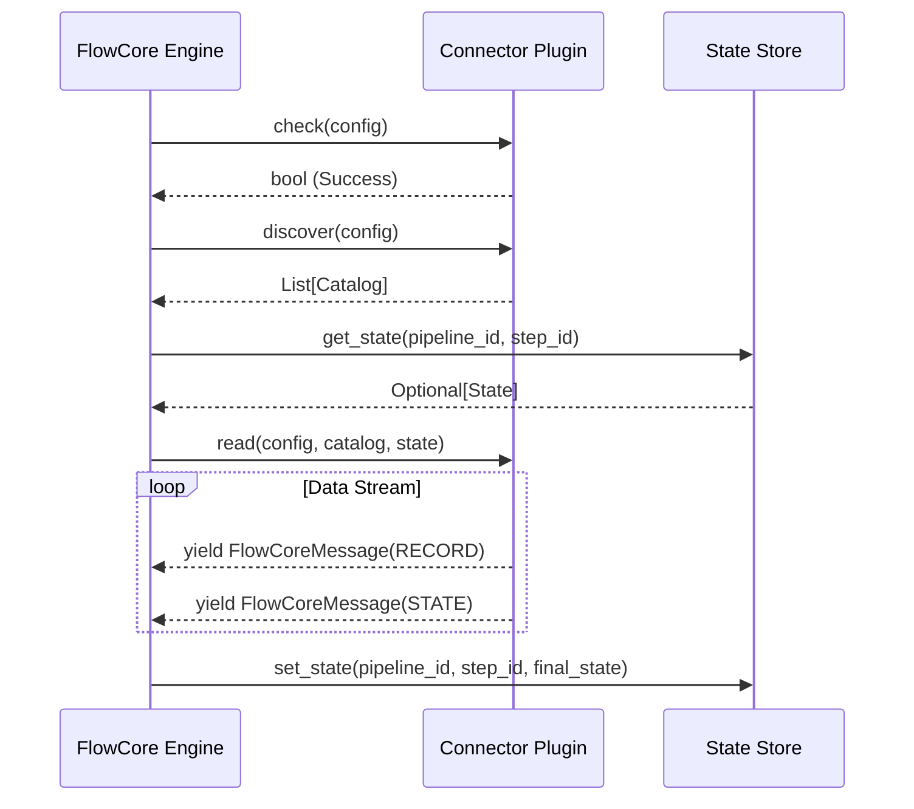

# Connector Lifecycle

This document describes the execution lifecycle of a FlowCore Connector.

## Mermaid Diagram

## Lifecycle Phases

1. **Validation (`check`)**: The engine asks the connector to validate its configuration and verify connectivity to the underlying resource.
2. **Discovery (`discover`)**: The engine asks the connector for the available data streams and their corresponding JSON schemas.
3. **Execution (`read` / `write` / `transform`)**: 
   - For a **Source**, the engine calls `read()`, injecting the last known `state`. The source yields a stream of records and new states.
   - For a **Destination**, the engine calls `write()`, providing a stream of incoming messages to be consumed and loaded.
   - For a **Transformer**, the engine calls `transform()`, providing an input stream and expecting an output stream of mutated messages.
