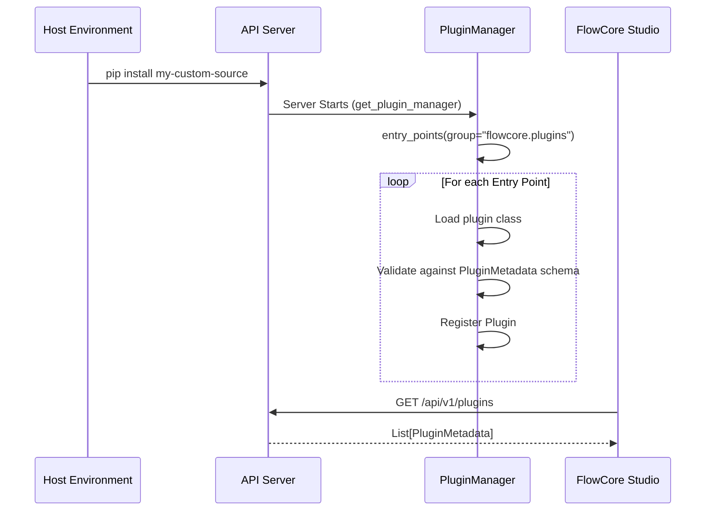

# Plugin Discovery Architecture

FlowCore heavily leverages Python's native `importlib.metadata.entry_points` mechanism to securely and dynamically discover installed plugins.

## Discovery Flow



## Creating an Entry Point

When packaging your plugin, you must declare it in your `pyproject.toml` configuration:

```toml
[project.entry-points."flowcore.plugins"]
my-custom-source = "my_custom_source.plugin:MyCustomSourcePlugin"
```

The FlowCore engine will detect this group upon startup and automatically register the plugin in the UI and engine registries.
