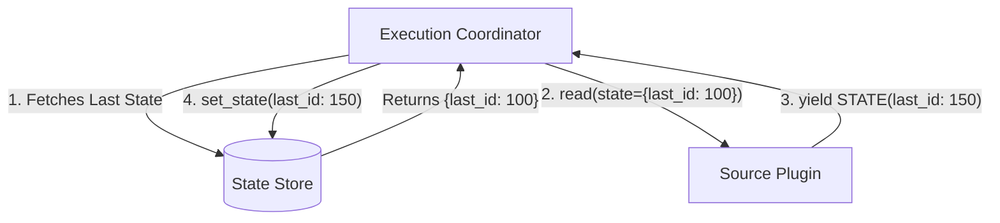

# Incremental State Management

The FlowCore engine implements an incremental state synchronization architecture, allowing source plugins to resume extraction from the last successful checkpoint rather than performing a full historical sync every time.

## How it Works

1. **State Injection**: When the Engine invokes a `SourcePlugin`, it injects a `state` payload into the `read()` method (if a previous execution completed successfully and saved state).
2. **State Emission**: As the source reads data, it periodically yields `FlowCoreMessage(type=STATE)` objects. The engine intercepts these during the pipeline stream.
3. **State Persistence**: The Engine extracts these state messages and sends them to the configured `StateStore` (e.g., Postgres, Redis, or File System) to be persisted against the `pipeline_id` and `step_id`.

## Mermaid Diagram

## Best Practices
- Connectors should yield state messages as frequently as is safe to acknowledge that previous records have been processed.
- State payloads should be opaque to the engine; the engine does not parse them, it only persists them.
